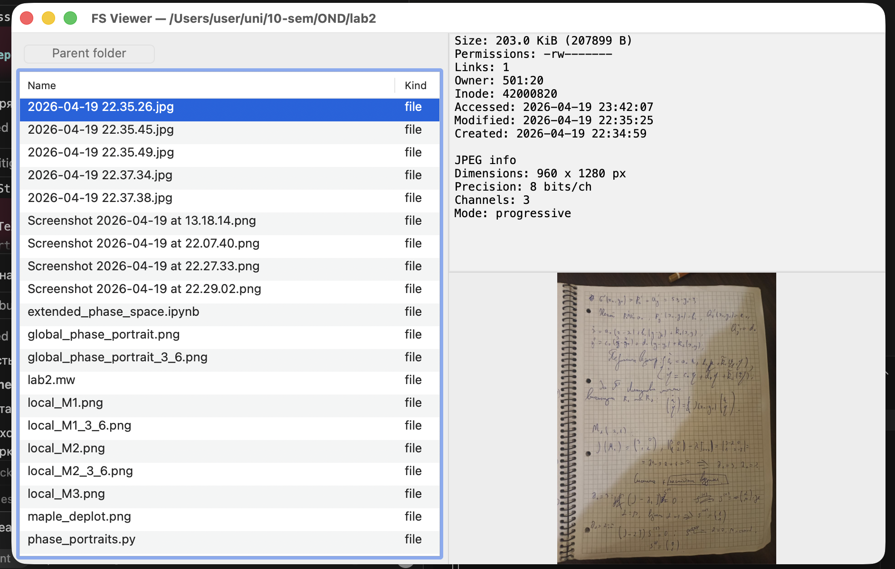
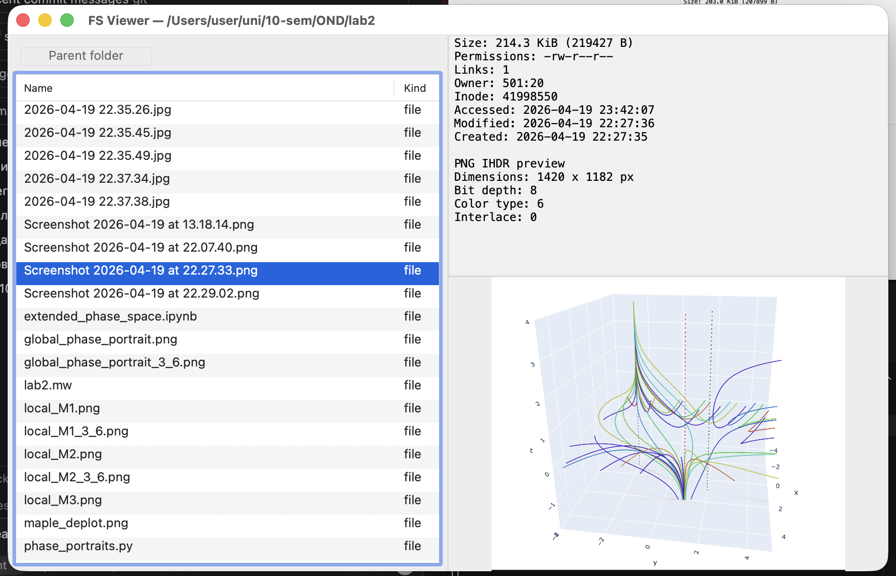

# pfs — two-pane File System Viewer (OS Lab 2, variant 4)

A macOS (Apple Silicon) file browser whose core logic is written in
**ARM64 assembly (AAPCS64)** and whose GUI is a thin **Objective-C /
AppKit** shell.

Left pane lists the active folder; right pane shows per-item details:

| Entry type        | Right-pane content                                          |
| ----------------- | ----------------------------------------------------------- |
| `.png`            | IHDR info (dimensions, bit depth, color type, interlace) + metadata + image preview |
| `.jpg`/`.jpeg`    | SOF info (dimensions, precision, channels, encoding mode) + metadata + image preview |
| folder            | Count of `.jpg` / `.png` files inside                       |
| any other file    | Rich metadata block (size, mode, owner, inode, 3 timestamps)|

The binary is called `pfs`.

## Screenshots

JPEG selected — asm-parsed SOF fields (dimensions, precision, channels,
encoding mode) combined with the full metadata block and an image
preview:



PNG selected — asm-parsed IHDR fields plus metadata and preview:



## Layout

```
src/
  fs.s            # directory walk, parent, jpg/png count, full metadata
  path_join.s     # pure-asm bounded path concatenation
  png_ihdr.s      # open/read/close + PNG signature & IHDR parsing
  jpeg_info.s     # open/read/close + JPEG marker walk & SOF parsing
  pfs_fmt.s       # str/u32/u64 bounded "append" helpers
  main.m          # NSApplication bootstrap
  AppDelegate.m   # AppKit window, table view, image view, actions
  pfs_core.h      # C-visible declarations of all asm entry points
Makefile          # top-level build
```

Only asm + AppKit bindings: no other dependencies.

## Requirements

* macOS 12+ on Apple Silicon (arm64).
* Xcode command line tools (`clang`, system headers, AppKit/Foundation
  frameworks): `xcode-select --install`.

## Build and run

```bash
make            # produces ./pfs
./pfs           # opens the main window in the current working directory
make clean      # remove build artifacts
```

The Makefile rules are:

```
*.s  --> clang -arch arm64 -c
*.m  --> clang -arch arm64 -fobjc-arc -c
link --> clang -framework Cocoa -framework Foundation
```

## Using the app

* Click a row to populate the right pane.
* Double-click a folder to enter it.
* **Parent folder** button goes one level up.
* Arrow keys work for row-by-row navigation.

## Assembly modules at a glance

### `path_join.s`

```
void path_join(char *out, size_t outsiz, const char *base, const char *name);
```

Produces `"base/name"` or `"/name"` when `base == "/"`. Bounded by
`outsiz-1`; always writes a trailing NUL. No external calls, no
callee-saved regs used → no stack frame needed.

### `pfs_fmt.s`

```
char *pfs_str_append(char *dst, char *end, const char *src);
char *pfs_u32_append(char *dst, char *end, uint32_t val);
char *pfs_u64_append(char *dst, char *end, uint64_t val);
```

Bounded "append" helpers. Numbers are formatted digit-by-digit using
`udiv`/`msub` (no `snprintf`, which is variadic — Darwin ARM64 passes
variadic args via the stack with a different layout, so avoiding it
removes a whole class of ABI bugs).

### `png_ihdr.s`

```
int png_format_ihdr_info(const char *path, char *buf, size_t buflen);
```

`open` → `read` (up to 8 KiB) → `close`, validates the 8-byte PNG
signature and the IHDR chunk, pulls width/height/bit depth/color
type/interlace, then emits a human-readable preview through the
`pfs_fmt` helpers.

### `jpeg_info.s`

```
int jpeg_format_info(const char *path, char *buf, size_t buflen);
```

`open` → `read` (up to 64 KiB) → `close`, validates the `FF D8` SOI
and walks JPEG segments: single-byte markers (`01`, `D0`–`D7`,
`D8`/`D9`) are skipped directly, everything else advances by the
big-endian 16-bit segment length. When the walk lands on an
SOF marker (`C0`–`CF` excluding `C4`/`C8`/`CC`) the routine pulls
precision, height, width and component count out of the segment
body, then emits:

```
JPEG info
Dimensions: <W> x <H> px
Precision: <P> bits/ch
Channels: <N>
Mode: baseline | extended sequential | progressive | lossless | differential | other
```

The "Mode" label is derived from the low nibble of the marker byte
(`C0`=baseline, `C2`=progressive, etc.). No `snprintf`, no C helpers,
no heap allocation — just the raw bytes, `pfs_str_append` and
`pfs_u32_append`.

### `fs.s`

```
int       fs_list_dir(const char *path);
void      path_parent_inplace(char *path);
int       fs_count_jpg_png(const char *dirpath);
long long pfs_file_size(const char *path);
int       pfs_file_mtime_iso(const char *path, char *buf, size_t buflen);
int       pfs_format_fullmeta(const char *path, char *buf, size_t buflen);
```

* `fs_list_dir` fills the BSS-resident `g_entries` array (up to 512
  entries of 264 bytes each, name + isdir flag) using
  `opendir` / `readdir` / `lstat`, sorts them with `qsort` (directories
  first, then alphabetically).
* `path_parent_inplace` strips the last component in place.
* `fs_count_jpg_png` counts regular files with `.jpg/.jpeg/.png`
  extensions (case-insensitive).
* `pfs_file_size` / `pfs_file_mtime_iso` are narrow accessors for size
  and modification time formatted as `%Y-%m-%d %H:%M:%S`.
* `pfs_format_fullmeta` emits the full metadata block:

```
Permissions: -rw-r--r--
Links: 1
Owner: 501:20
Inode: 123456
Accessed: 2026-04-20 01:29:00
Modified: 2026-04-19 22:35:09
Created:  2026-04-18 14:00:00
```

Permission bits are built from two lookup tables (one 16-byte type
table, one 18-byte `(bit_index, char)` table) rather than a run of
conditional moves.

## ABI / AAPCS64 notes

`x19`–`x28` are callee-saved. Clang under Objective-C ARC parks
`self` in `x19` for the entire method body. Every asm routine here
either:

* never writes to `x19`–`x28`, or
* saves/restores **every** register it touches with paired
  `stp`/`ldp` (`x19,x20`, `x21,x22`, `x23,x24`, `x25,x26`, `x27,x28`).

This eliminates the crash class "clicking Parent folder / a file
segfaults inside `objc_msgSend`": a subtle bug that appears only
after a few UI interactions because `self` gets silently corrupted
across a non-compliant asm call.
