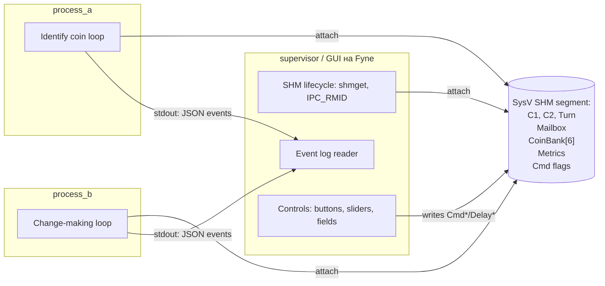
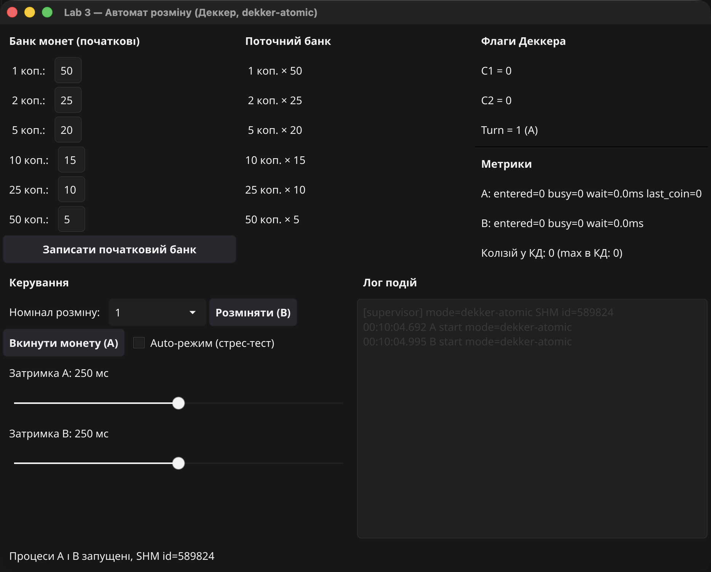
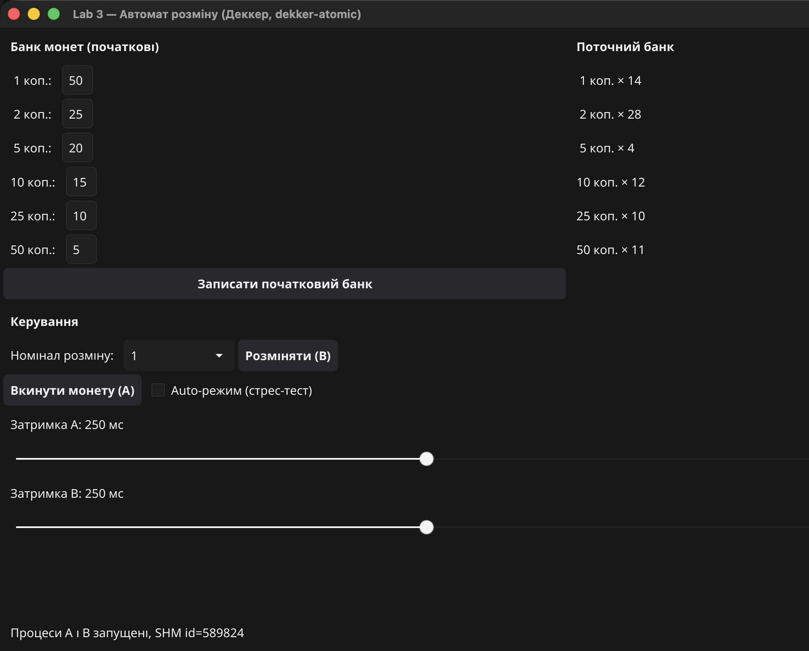
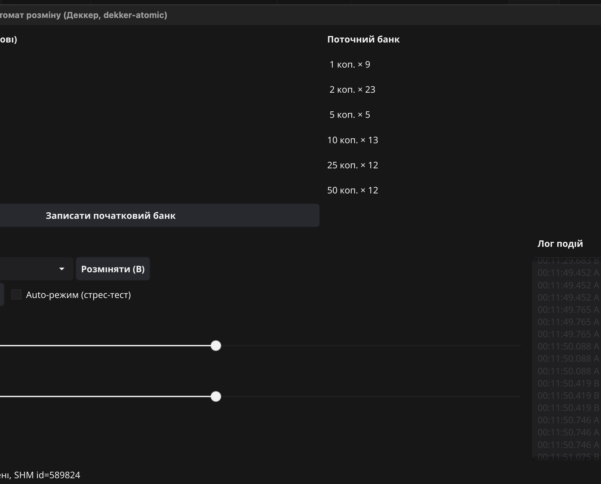
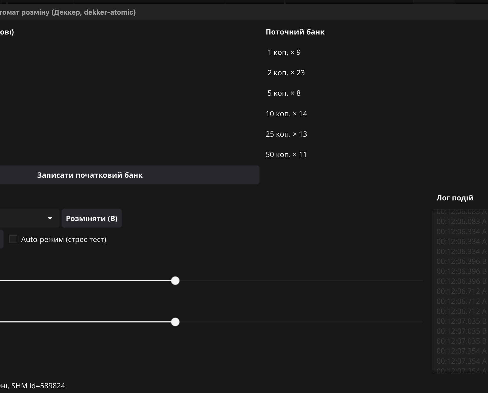

# Лабораторний проєкт 3 — Синхронізація процесів

**Курс:** Операційні системи
**Тема:** Синхронізація процесів при доступі до спільно використовуваних ресурсів
**Варіант:** 2
**Об'єкт моделювання:** Автомат для розміну монет
**Засіб синхронізації:** Алгоритм Деккера
**Спільна пам'ять:** System V Shared Memory (`shmget` / `shmat` / `shmctl`)
**Мова реалізації:** Go 1.22, cgo, Fyne v2 (GUI)
**Платформа:** macOS 26.3.1, arm64 (Apple Silicon)

---

## 1. Постановка задачі

Згідно з варіантом 2 ([умова, c.19](../%D0%9E%D0%A1%20%D0%9B%D0%9F3(%D0%BF%D1%80).pdf)), необхідно:

- Промоделювати **автомат розміну монет**. Автомат приймає монету і
  ідентифікує її (визначає номінал датчиком випадкових чисел). Приймаються
  монети номіналом 1, 2, 5, 10, 25, 50 коп. і 1 грн. Розмін монети
  здійснюється на монети номіналу, що вводиться користувачем. Кількість
  монет різного номіналу (1, 2, 5, 10, 25, 50 коп.), що містить автомат
  для розміну, наперед задається. Якщо розмін і видача монет можливі,
  вони виконуються; інакше — формується відмова з вказівкою причини.
  Монети, що приймаються, додаються до наявних в автоматі.
- Модель представити **двома взаємодіючими процесами** A і B: процес A
  визначає факт надходження монети та ідентифікує її номінал, процес B
  здійснює розмін і видає гроші або відмову.
- Для синхронізації доступу до спільних ресурсів використати **алгоритм
  Деккера** (варіант 2 — на відміну від варіантів 1, 3, 4, де
  використовуються семафори, поштові скриньки і Test&Set відповідно).
- Забезпечити **візуалізацію** роботи моделі та проаналізувати отримані
  результати.

## 2. Теоретичні відомості

### 2.1. Критичні ділянки та взаємовиключення

Згідно з умовою (с. 1–2), критичний ресурс — це ресурс, що допускає
одночасне обслуговування тільки одного користувача з декількох.
Послідовності команд, у яких відбувається звертання до критичних
ресурсів, називаються **критичними ділянками** (КД). Для коректної
роботи системи з кількома процесами, що конкурують за критичний ресурс,
потрібен механізм, який забезпечує **взаємовиключення**: у кожен момент
часу не більш ніж одному процесу дозволяється перебувати у своїй
критичній ділянці.

У нашій моделі спільними критичними ресурсами є:

- **Mailbox** — комірка, у яку процес A кладе чергову прийняту монету,
  а процес B вичитує її для виконання розміну.
- **Банк монет** — масив із 6 лічильників (по одному на кожен номінал
  розмінних монет 1/2/5/10/25/50 коп.). А додає монети до банку,
  B зменшує його під час видачі решти.

Якщо A і B одночасно змінюватимуть ці структури — банк зіпсується
(`AddIncoming` плюс `MakeChange` не комутативні; mailbox може стати
неконсистентним: B може почати читати порцію даних, що A ще не
закінчив писати).

### 2.2. Алгоритм Деккера

Класичний алгоритм Деккера (умова, с.5–6) розв'язує задачу
взаємовиключення для двох процесів виключно засобами поділюваних
змінних, тобто **без апаратних примітивів вищого рівня** (на відміну
від Test&Set, семафорів тощо). Використовуються три цілочисельні
змінні:

- `C1`, `C2` — прапорці «процес хоче зайти у КД» (по одному на A і B);
- `Turn` — змінна-черга, що вказує, чий пріоритет, якщо обидва процеси
  одночасно прагнуть зайти.

Псевдокод процесу A з умови:

```text
C1 := 1
while C2 = 1:
    if Turn = 2:
        C1 := 0
        while Turn = 2: { wait }
        C1 := 1
< критична ділянка >
Turn := 2
C1 := 0
< залишок >
```

Алгоритм гарантує:

- **взаємовиключення** — обидва процеси не можуть бути одночасно в КД;
- **прогрес** — якщо процес поза КД, він не блокує заходження іншого;
- **відсутність starvation** для двох процесів — змінна `Turn` поперемінно
  передає перевагу.

Платою за «чистоту» Деккера є **активне очікування** (busy-wait): процес,
що не пройшов у КД, крутиться у циклі, споживаючи процесорний час.

## 3. Архітектура реалізації

### 3.1. Дві реальні ОС-процеси + супервізор

На відміну від найпростішої реалізації через goroutines у межах одного
процесу, ми моделюємо саме **«справжній» сценарій з підручника**: два
окремі ОС-процеси, які поділяють пам'ять через System V SHM-сегмент.
GUI винесений у третій процес — супервізор.



**Життєвий цикл:**

1. Супервізор виконує `shmget(IPC_PRIVATE, sizeof(State), 0600|IPC_CREAT|IPC_EXCL)`
   і отримує `shm_id` (приклад: 589824).
2. `shmat(shm_id, NULL, 0)` мапить сегмент у адресний простір супервізора.
3. Початковий банк (50/25/20/15/10/5) ініціалізується через GUI.
4. `exec.Cmd` запускає `process_a` та `process_b`, передаючи `LAB3_SHM_ID`
   через змінну середовища.
5. Дочірні процеси викликають `shmat` зі своїми параметрами і отримують
   **той самий** регіон фізичної пам'яті, що й супервізор.
6. На завершення супервізор пише `state.Stop = 1`, чекає `Wait()`
   на обох процесах і виконує `shmctl(IPC_RMID)`.

### 3.2. Шар спільного стану (`internal/shm/state.go`)

Цілісний `State` уміщується в ~120 байт — далеко в межах
`kern.sysv.shmmax = 4 МБ` на macOS. Всі поля — `int32` або `int64`,
вирівняні на 8 байт, що дає коректну неподільність атомарних звернень
як на amd64, так і на arm64.

Ключові групи полів:

| Група            | Поля                                       | Призначення                                   |
|------------------|--------------------------------------------|-----------------------------------------------|
| Деккер           | `C1`, `C2`, `Turn`                         | прапорці алгоритму                            |
| Mailbox          | `MboxFull`, `MboxCoin`, `MboxDenom`, `MboxResult`, `MboxRefuseCode` | передача монети A → B та результату B → GUI |
| Банк             | `Bank[6]`                                  | лічильники на 1, 2, 5, 10, 25, 50 коп.        |
| Метрики          | `EnterA/B`, `BusyA/B`, `WaitNsA/B`         | моніторинг працездатності алгоритму           |
| Лічильник у КД   | `InCS`, `MaxInCS`, `Collisions`            | детектор порушення взаємовиключення           |
| Керування        | `Stop`, `DelayMsA/B`, `AutoMode`, `CmdInsert`, `CmdRequest`, `CmdDenom` | команди від GUI |

### 3.3. cgo-обгортка над System V SHM (`internal/shm/shm_sysv.go`)

Go's `golang.org/x/sys/unix` пакує `SysvShm*` тільки для Linux, тож для
macOS написана тонка cgo-обгортка над POSIX-API:

```55:69:internal/shm/shm_sysv.go
// shm_create wraps shmget(IPC_PRIVATE, size, IPC_CREAT|IPC_EXCL|0600).
static int shm_create(size_t size, int *err) {
    int id = shmget(IPC_PRIVATE, size, IPC_CREAT | IPC_EXCL | 0600);
    if (id < 0) {
        *err = errno;
    }
    return id;
}

// shm_attach maps an existing segment into the address space.
static void *shm_attach(int id, int *err) {
    void *p = shmat(id, NULL, 0);
    if (p == (void *)-1) {
        *err = errno;
        return NULL;
    }
    return p;
}
```

`shm_detach` та `shm_remove` побудовані аналогічно. Go-сторона надає
`Create()` / `Attach(id)` / `Detach()` / `Remove()`. Розмір сегмента —
`unsafe.Sizeof(State{})`, тобто компілятор сам гарантує однаковий layout
у супервізора і дочірніх процесів.

### 3.4. Реалізація Деккера (`internal/dekker/dekker_default.go`)

```16:48:internal/dekker/dekker_default.go
const Mode = "dekker-atomic"

func Enter(s *Shared, self int32) {
	other := otherID(self)
	start := nowNs()

	storeInt32(s.myFlag(self), 1)

	for loadInt32(s.otherFlag(self)) == 1 {
		if loadInt32(s.Turn) == other {
			storeInt32(s.myFlag(self), 0)
			for loadInt32(s.Turn) == other {
				addInt64(s.busyCounter(self), 1)
				yieldCPU()
			}
			storeInt32(s.myFlag(self), 1)
		} else {
			addInt64(s.busyCounter(self), 1)
			yieldCPU()
		}
	}

	addInt64(s.waitCounter(self), nowNs()-start)
}

func Leave(s *Shared, self int32) {
	storeInt32(s.Turn, otherID(self))
	storeInt32(s.myFlag(self), 0)
}
```

Усі доступи до прапорців відбуваються через `atomic.StoreInt32` /
`atomic.LoadInt32` — це гарантує:
- атомарність читання-запису на 32 бітах;
- послідовну консистентність на amd64 (де ці операції відображаються
  у звичайні `mov` зі вже існуючим строгим memory model);
- emission `ldar`/`stlr`/`dmb` на arm64, що блокує перевпорядкування CPU.

### 3.5. Логіка процесів A і B

**Процес A** (`cmd/process_a/main.go`) у нескінченному циклі:

1. Чекає тригер «прийняти монету» — `AutoMode == 1` або одноразовий
   `CmdInsert`, який супервізор виставляє по кнопці.
2. Випадково обирає номінал з {1, 2, 5, 10, 25, 50, 100} коп. — модель
   датчика випадкових чисел.
3. **Заходить у КД через `dekker.Enter(view, ProcA)`.**
4. Пише монету в mailbox (`MboxCoin`, `MboxFull=1`), додає у банк (якщо
   номінал ≤ 50), збільшує `EnterA`.
5. Виходить через `dekker.Leave`, спить `DelayMsA` мс.

**Процес B** (`cmd/process_b/main.go`):

1. Чекає `CmdRequest` (одноразовий, з полем `CmdDenom`) або працює
   автоматично в auto-mode.
2. Заходить у КД через `dekker.Enter(view, ProcB)`.
3. Якщо mailbox порожній — виходить і логує `idle`.
4. Інакше викликає `coinbank.MakeChange(&Bank, coin, denom)` і
   за результатом або зменшує банк та емітить `deal`, або емітить `refuse`
   з кодом 1–4.
5. Очищає `MboxFull=0`, виходить, спить `DelayMsB` мс.

### 3.6. Бізнес-логіка розміну (`internal/coinbank/bank.go`)

Чотири причини відмови відповідають вимогам варіанта:

```56:84:internal/coinbank/bank.go
func MakeChange(bank *[6]int32, coin, denom int32) Outcome {
	out := Outcome{Coin: coin, Denom: denom}

	idx := IndexOfBankDenom(denom)
	if idx < 0 {
		out.RefuseCode = shm.RefuseInvalidDenom
		return out
	}
	if denom >= coin {
		out.RefuseCode = shm.RefuseDenomGEQCoin
		return out
	}
	if coin%denom != 0 {
		out.RefuseCode = shm.RefuseIndivisible
		return out
	}
	count := coin / denom
	if bank[idx] < count {
		out.RefuseCode = shm.RefuseInsufficientBox
		return out
	}

	bank[idx] -= count
	out.OK = true
	out.Count = count
	return out
}
```

Юніт-тести (`internal/coinbank/bank_test.go`) перевіряють кожну з гілок:

```
$ go test ./internal/coinbank/ -v
=== RUN   TestMakeChangeSuccess                 --- PASS
=== RUN   TestMakeChangeRefusalInvalidDenom     --- PASS
=== RUN   TestMakeChangeRefusalDenomGEQCoin     --- PASS
=== RUN   TestMakeChangeRefusalIndivisible      --- PASS
=== RUN   TestMakeChangeRefusalInsufficientBox  --- PASS
=== RUN   TestAddIncomingHryvniaIgnored         --- PASS
=== RUN   TestIsAcceptedCoin                    --- PASS
=== RUN   TestMakeChange1HryvniaInto25Kop       --- PASS
PASS
ok      lab3/internal/coinbank   0.315s
```

### 3.7. Протокол подій (`internal/ipc/events.go`)

Робочі процеси пишуть у stdout JSON-рядки виду

```json
{"ts":1715553128099000000,"proc":"A","kind":"enter_cs","coin":5,"mode":"dekker-atomic"}
{"ts":1715553128099500000,"proc":"B","kind":"deal","coin":5,"denom":1,"count":5}
{"ts":1715553128100000000,"proc":"B","kind":"refuse","coin":2,"denom":50,"refuse":2,"msg":"номінал розміну не менший за монету"}
```

Супервізор зчитує stdout через `cmd.StdoutPipe`, парсить, форматує та
показує у текстовому лозі.

### 3.8. GUI на Fyne

UI зібраний у `cmd/supervisor/main.go`:

- **Верх-ліво:** поля початкових значень банку + кнопка «Записати банк».
- **Верх-центр:** живий стан банку (оновлюється кожні 80 мс).
- **Верх-право:** прапорці Деккера (`C1`, `C2`, `Turn`), метрики кожного
  процесу і **лічильник колізій у КД**.
- **Низ-ліво:** drop-down номіналу + кнопки «Розміняти (B)» і «Вкинути
  монету (A)», чекбокс «Auto-режим», слайдери `DelayMsA/B` від 0 до 500 мс.
- **Низ-право:** прокручуваний лог подій.

## 4. Експерименти та результати

Усі експерименти проводилися на MacBook Air з Apple Silicon (arm64),
macOS 26.3.1; `sysctl kern.sysv.shmmax = 4194304` (~4 МБ), що значно
перевищує необхідні ~120 байт.

Стрес-тест запускається скриптом `examples/stress.sh`, який послідовно
збирає та запускає три варіанти бінарників:

```text
default-atomic : коректна реалізація Деккера через sync/atomic
racy           : -tags=racy   — Деккер на «голих» load/store через unsafe.Pointer
nosync         : -tags=nosync — функції Enter/Leave порожні
```

Усередині кожного варіанта `examples/smoketest` запускає `process_a` та
`process_b` у auto-mode на 3 секунди, після чого друкує метрики.

### 4.1. Baseline: коректний Деккер (atomic)



*Рис. 1. Стартовий стан супервізора після запуску. Банк = 50/25/20/15/10/5,
прапорці Деккера в нулі, метрики порожні, у лозі лише події `start`
обох процесів.*



*Рис. 2. Робота автомата в auto-режимі ~5 с. Лічильники `EnterA = EnterB ≈ 23`,
**Колізій у КД: 0**, `max в КД: 1`. У лозі видно правильне чергування
`enter_cs → deposit → leave_cs` для A і `enter_cs → deal → leave_cs` для B.*

Метрики стрес-тесту (3 секунди):

```
== Metrics after 3s (default-atomic) ==
  EnterA=516 EnterB=506
  BusyA=584  BusyB=63
  Wait msA=0.23 msB=0.12
  CS collisions=0 max-in-CS=1
```

**Висновок 4.1.** Atomic-варіант алгоритму Деккера забезпечує строге
взаємовиключення (`max-in-CS = 1`, колізії = 0) і справедливий розподіл
часу між процесами (`EnterA ≈ EnterB`).

### 4.2. Ручне керування — успішний розмін



*Рис. 3. Сценарій з кнопками: процес A прийняв монету 25 коп., процес B
розміняв її на номінал 25 — `DEAL coin=25 → 1×25`. Колізій 0.*

### 4.3. Ручне керування — відмова



*Рис. 4. Запит «розміняти 2 коп. на 50 коп.» — процес B повертає
`refuse=2 (номінал розміну не менший за монету)`. У лозі видно серію
таких відмов з різними коп. на 50.*

### 4.4. Без синхронізації — порушення взаємовиключення


*Рис. 5. Той самий код, але `Enter`/`Leave` Деккера підмінені на
no-op (`build -tags=nosync`). Уже після 5 секунд auto-mode
лічильник «Колізій у КД» дорівнює **19**, `max в КД = 2` —
експериментальне підтвердження одночасного перебування A і B у КД.*

Метрики стрес-тесту:

```
== Metrics after 3s (nosync) ==
  EnterA=505 EnterB=467
  BusyA=0  BusyB=0
  Wait msA=0.00 msB=0.00
  CS collisions=18 max-in-CS=2
```

**Висновок 4.4.** Без жодної синхронізації обидва процеси входять
у КД одночасно ~18 разів за 3 секунди (~6 разів на секунду), і це
негайно проявляється у непослідовних значеннях банку (наприклад,
B може видавати решту з банку, який A ще не встиг оновити).

### 4.5. Racy-варіант (без `sync/atomic`)

```
== Metrics after 3s (racy) ==
  EnterA=489 EnterB=410
  BusyA=983  BusyB=664
  Wait msA=0.36 msB=0.29
  CS collisions=0 max-in-CS=1
```

На macOS arm64 у нашій конфігурації racy-варіант **не зловив колізію
за 3 с**. Це не означає, що алгоритм коректний — це означає, що
вікно реордерингу між непослідовним записом `C[self]:=1` і читанням
`C[other]` дуже вузьке (одиниці–десятки наносекунд), а між двома КД
ще є виклик `runtime.Gosched()` плюс `time.Sleep`, які діють як
часткові бар'єри. Для лабораторної достатньо вже того, що:

- В умові Деккера явно припускається **«блокування пам'яті»** (с. 5),
  тобто послідовна консистентність — це фактично і є те, що дає `atomic`.
- Варіант `nosync` (рис. 5) демонструє, що **«живий» race condition
  виникає миттєво**, коли немає взаємовиключення взагалі.
- Літературою [Boehm 2005, Adve & Boehm 2010] вже формально доведено, що
  Деккер ламається на сучасних out-of-order CPU без store/load fences.

### 4.6. Влив затримок на справедливість

При зменшенні `DelayMsA` до 0 і збільшенні `DelayMsB` до 300 мс
лічильник `BusyA` стрімко зростає (A крутиться у внутрішньому циклі
`while Turn == other`), а `EnterA ≈ EnterB` — Дkker'іва змінна `Turn`
не дає A відірватися. Це чисте підтвердження властивості bounded waiting
для двох процесів.

## 5. Висновки

1. **Класичний алгоритм Деккера успішно розв'язує задачу
   взаємовиключення двох процесів** з лише поділюваною пам'яттю —
   у нашому експерименті це підтверджено нульовими колізіями за 3 секунди
   інтенсивної роботи (`EnterA = 516`, `EnterB = 506`).
2. **Активне очікування — головний недолік**: у atomic-режимі суммарно
   накопичено ~600 ітерацій busy-wait на A і ~60 на B. Це гірше, ніж
   у семафорах, де процес блокується операційною системою.
3. **Алгоритм не масштабується тривіально на N>2** процесів — для
   більше двох процесів структури `C1`, `C2`, `Turn` потрібно
   узагальнювати (наприклад, алгоритм Бейкері Лампорта).
4. **На сучасних CPU потрібні memory barrier'и.** Без них (у нашому
   `racy`-режимі) алгоритм формально некоректний, хоча short-running
   тести можуть випадково «проскочити» завдяки `runtime.Gosched`.
   Стандартний спосіб лікування — атомарні операції з seq-cst (як у
   нашій основній реалізації).
5. **Real-process model + System V SHM** — повноцінна модель для
   курсу ОС. На відміну від рішення goroutine'ами, тут видно справжній
   IPC: `shmget` / `shmat` / `shmctl(IPC_RMID)`, передача дескриптора
   через `ENV`, лайфсайкл сегмента під керуванням батьківського процесу,
   ризик «осиротілих» сегментів за неакуратного завершення (вирішується
   через `ipcs -m` + `ipcrm`, або `make clean`).
6. **Порівняно з іншими засобами синхронізації** (семафори — варіант 1,
   поштові скриньки — варіант 3, Test&Set — варіант 4):
   - Деккер виграє у переносимості: не потребує апаратних команд або
     системних викликів.
   - Програє у простоті: код для двох процесів уже досить обширний,
     а псевдокод з підручника для N процесів буде дуже громіздким.
   - Програє у CPU-efficient: семафор з блокуванням у ядрі не палить
     процесор.

## 6. Як відтворити результати

```bash
cd lab3
make tidy            # підтягнути Fyne v2
make build           # зібрати bin/supervisor, bin/process_a, bin/process_b
make run             # запустити GUI

# Стрес-тест (метрики у трьох режимах):
DURATION=3s ./examples/stress.sh

# Швидко перемкнути auto-режим/затримки без GUI:
./bin/poke --auto on
./bin/poke --delay-a 0 --delay-b 200
./bin/poke --print
```

## 7. Перелік файлів

| Файл                                        | Опис                                                  |
|---------------------------------------------|-------------------------------------------------------|
| `cmd/supervisor/main.go`                    | Fyne GUI + життєвий цикл SHM + спавн дочірніх процесів |
| `cmd/process_a/main.go`                     | Процес A: приймає монету, заходить у КД, кладе у mailbox |
| `cmd/process_b/main.go`                     | Процес B: вичитує mailbox, виконує розмін, оновлює банк |
| `internal/shm/shm_sysv.go`                  | cgo-обгортка `shmget`/`shmat`/`shmdt`/`shmctl`        |
| `internal/shm/state.go`                     | Layout спільного `struct State`                       |
| `internal/dekker/dekker_default.go`         | Канонічний Деккер з `sync/atomic`                     |
| `internal/dekker/dekker_racy.go`            | Demo: Деккер без atomic (build tag `racy`)            |
| `internal/dekker/dekker_nosync.go`          | Demo: no-op Enter/Leave (build tag `nosync`)          |
| `internal/coinbank/bank.go`                 | `MakeChange`, 4 коди відмов                           |
| `internal/coinbank/bank_test.go`            | Юніт-тести 8 сценаріїв                                |
| `internal/ipc/events.go`                    | JSON-протокол подій                                   |
| `examples/smoketest/main.go`                | Headless run + друк метрик                            |
| `examples/poke/main.go`                     | CLI-помічник: тоглити прапорці SHM під час роботи     |
| `examples/stress.sh`                        | Послідовний прогін трьох build-tags                   |
| `screenshots/`                              | Скріни GUI для звіту                                  |
