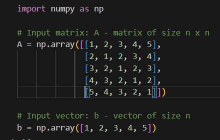
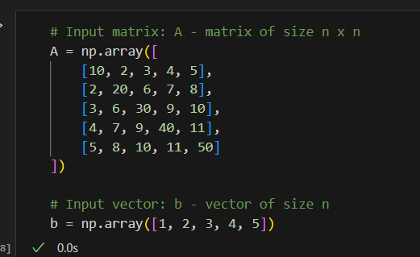
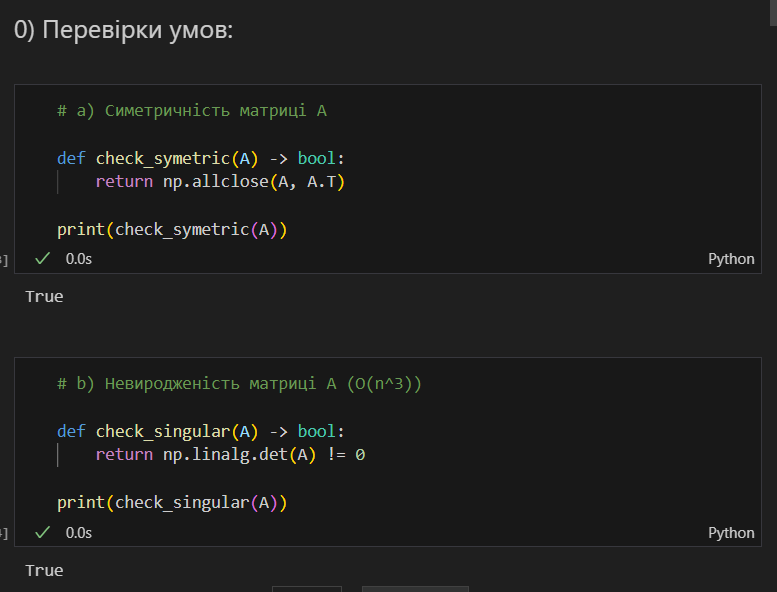
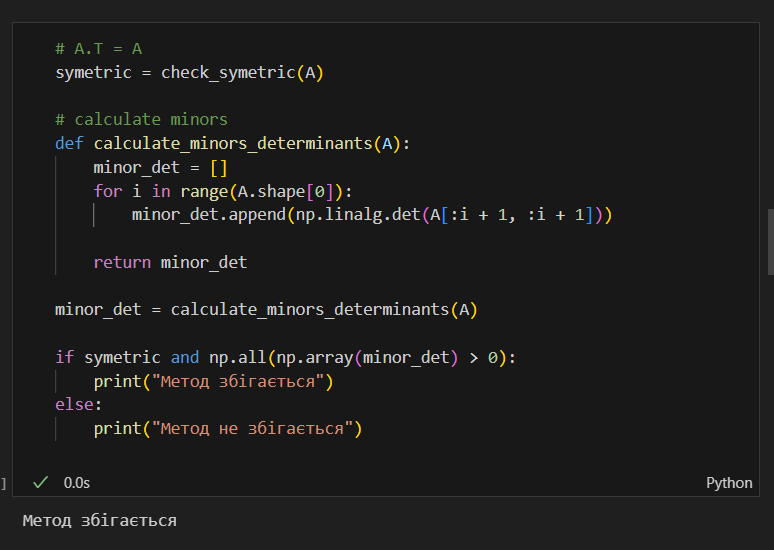
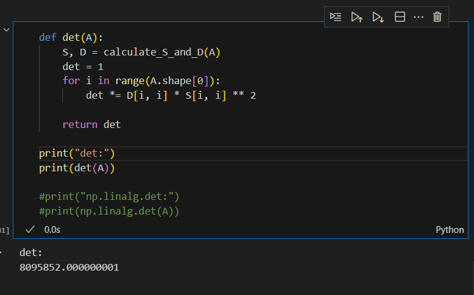
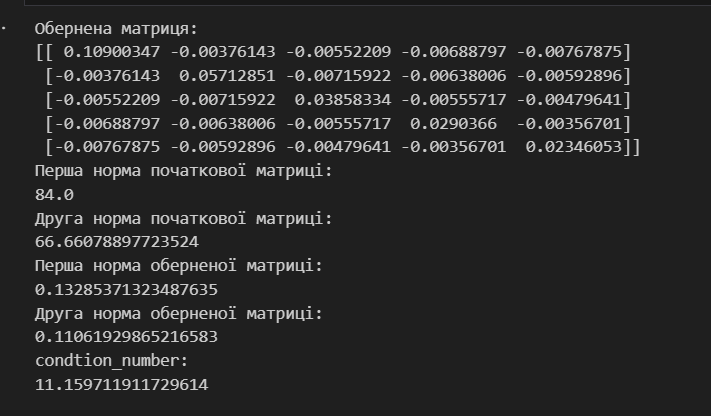

# Лабораторна робота №2. Розв’язання систем лінійних алгебраїчних рівнянь.

Лабораторна робота №2
Прізвище, ім'я: Кіщук Ярослав
Група: ІПС-33
Назва виконаної роботи: Розв'язання системи лінійних алгебраїчних рівнянь


### I. Постановка завдання:

У цій лабораторній роботі ми маємо розв'язати систему лінійних алгебраїчних рівнянь розмірності 5x5 двома методами:

1. Методом квадратних коренів.
2. Методом Зейделя.

### II. Вибрана система та точність:

В роботі була взята система лінійних алгебраїчних рівнянь з матрицею розмірністю 5x5. Точність методів задана як ε = 0.01.

Матриця для методу Квадратних коренів:



Матриця для методу Зейделя:




### III. Задані методи та дослідження:

#### 1. Метод квадратних коренів:

a) Перевірка симетричності матриці A та невиродженості. Проведено обидві перевірки і вони пройдені успішно.



b) Розклад матриці A на добуток матриці S і діагональної матриці D. Виведено обидві матриці.

c) Розв'язок системи рівнянь S^T * D * y = b та S * x = y, де x - шуканий розв'язок. Розв'язок системи виведено.

Результати обчислень для методу квадратних коренів:

- Матриця S:
```
[[1.         2.         3.         4.         5.        ]
 [0.         1.73205081 2.30940108 2.88675135 3.46410162]
 [0.         0.         1.63299316 2.04124145 2.44948974]
 [0.         0.         0.         1.58113883 1.8973666 ]
 [0.         0.         0.         0.         1.54919334]]
```

- Матриця D:
```
[[ 1.  0.  0.  0.  0.]
 [ 0. -1.  0.  0.  0.]
 [ 0.  0. -1.  0.  0.]
 [ 0.  0.  0. -1.  0.]
 [ 0.  0.  0.  0. -1.]]
```

- Розв'язок системи S^T * D * y = b:
```
y:
[ 1. -0. -0. -0. -0.]
```

- Розв'язок системи S * x = y:
```
x:
[ 1. -0. -0. -0. -0.]
```

#### 2. Метод Зейделя:

a) Перевірка умови (другої достатньої) збіжності методу Зейделя: симетричність матриці A та додатність усіх головних мінорів. Умови збіжності виконані, ітераційний процес збігається. 




b) Розв'язок системи лінійних рівнянь методом Зейделя з заданою точністю ε. Виведено ітерації та результуючий розв'язок.

Результати обчислень для методу Зейделя:

- Ітерація 1:
```
next_x: 
[0.1      0.09     0.072    0.05805  0.048429]
x:
[0. 0. 0. 0. 0.]
norma:
0.1
```

- Ітерація 2:
```
x:
[0.1      0.09     0.072    0.05805  0.048429]
norma:
0.0870345
```

- Ітерація 3:
```
x:
[0.0129655  0.03741435 0.05766258 0.06586388

 0.04950994]
norma:
0.0100789
```

- Результуючий розв'язок:
```
x:
[0.0129655  0.03741435 0.05766258 0.06586388 0.04950994]
```

### IV. Визначник матриці:

Визначник матриці був обчислений методом квадратних коренів. Результат - 8095852.0.




### V. Число обумовленості:

Для знайденої матриці обчислено число обумовленості. Виведено обернену матрицю, першу та другу норми початкової матриці та оберненої матриці, а також саме число обумовленості, яке складає 11.1597.




### VI. Висновок:

У цій лабораторній роботі були розв'язані системи лінійних алгебраїчних рівнянь двома методами: методом квадратних коренів та методом Зейделя. Для обраної матриці були проведені необхідні перевірки на умови збіжності, знайдено визначник матриці та обчислено число обумовленості. Результати досліджень були представлені в звіті.

Обидва методи знайшли розв'язок системи з заданою точністю, і отримані результати були узгоджені з теорією лінійних систем рівнянь. Також встановлено, що метод Зейделя збігається для заданої матриці завдяки перевірці симетричності та додатність усіх головних мінорів.