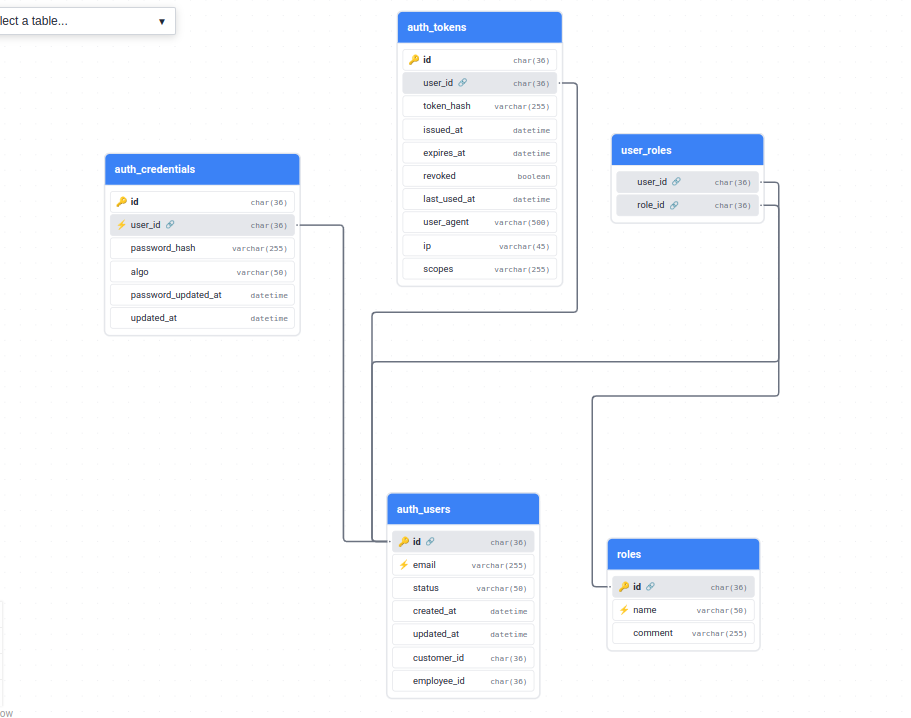

# Лабораторна робота: Створення реляційних баз даних для системи TechMarket

**Виконав:** Кіщук Ярослав  
**Дата:** 7 жовтня 2025  
---

## Зміст

1. [Вступ](#вступ)
2. [Етап 1: Створення DBML схем](#етап-1-створення-dbml-схем)
3. [Етап 2: Генерація SQL з DBML](#етап-2-генерація-sql-з-dbml)
4. [Етап 3: Docker Compose конфігурація](#етап-3-docker-compose-конфігурація)
5. [Етап 4: Генерація тестових даних](#етап-4-генерація-тестових-даних)
6. [Результати](#результати)
7. [Висновки](#висновки)

---

## Вступ

Метою роботи є створення реляційних баз даних для системи TechMarket, яка використовує мікросервісну архітектуру з паттерном Database-per-Service. Система включає:

- **Auth DB (MySQL)** - автентифікація та авторизація
- **Catalog DB (MySQL)** - каталог товарів та категорій
- **Orders DB (MySQL)** - замовлення, клієнти, менеджери
- **Payments DB (MySQL)** - платежі
- **DWH DB (PostgreSQL)** - сховище даних для аналітики

---

## Етап 1: Створення DBML схем

### 1.1 ER діаграми системи

Система TechMarket має наступні ER діаграми:


*Рисунок 1: ER діаграма Auth сервісу*


*Рисунок 2: ER діаграма Catalog сервісу*


*Рисунок 3: ER діаграма Orders сервісу*


*Рисунок 4: ER діаграма Data Warehouse (Star Schema)*

### 1.2 Структура DBML файлів

Створено 5 DBML файлів:

1. **auth_mysql.dbml** - 5 таблиць (auth_users, auth_credentials, auth_tokens, roles, user_roles)
2. **catalog_mysql.dbml** - 2 таблиці (categories, products)
3. **orders_mysql.dbml** - 5 таблиць (customers, regions, employees, orders, order_items)
4. **payments_mysql.dbml** - 1 таблиця (payments)
5. **dwh_postgres.dbml** - 7 таблиць (6 dimension + 1 fact table)

```
docs/db/
├── auth_mysql.dbml
├── catalog_mysql.dbml
├── orders_mysql.dbml
├── payments_mysql.dbml
└── dwh_postgres.dbml
```

### 1.3 DBML діаграми




---

## Етап 2: Генерація SQL з DBML

### 2.1 Встановлення DBML CLI

```bash
npm install -g @dbml/cli
```

### 2.2 Конвертація DBML в SQL

Команда для генерації SQL:

```bash
cd docs/db
dbml2sql auth_mysql.dbml --mysql -o ../../database/init/01_auth_schema.sql
dbml2sql catalog_mysql.dbml --mysql -o ../../database/init/02_catalog_schema.sql
dbml2sql orders_mysql.dbml --mysql -o ../../database/init/03_orders_schema.sql
dbml2sql payments_mysql.dbml --mysql -o ../../database/init/04_payments_schema.sql
dbml2sql dwh_postgres.dbml --postgres -o ../../database/init/05_dwh_schema.sql
```

**Результат:**

```
✔ Generated SQL dump file (MySQL): 01_auth_schema.sql
✔ Generated SQL dump file (MySQL): 02_catalog_schema.sql
✔ Generated SQL dump file (MySQL): 03_orders_schema.sql
✔ Generated SQL dump file (MySQL): 04_payments_schema.sql
✔ Generated SQL dump file (PostgreSQL): 05_dwh_schema.sql
All SQL schemas regenerated successfully!
```

### 2.3 Приклад згенерованого SQL

**Auth DB (MySQL):**

```sql
CREATE TABLE `auth_users` (
  `id` CHAR(36) PRIMARY KEY,
  `email` varchar(255) UNIQUE COMMENT 'Логін користувача',
  `status` varchar(50) COMMENT 'active, disabled, blocked',
  `created_at` datetime,
  `updated_at` datetime,
  `customer_id` CHAR(36) COMMENT 'Ref: Orders DB (customers.id), без FK',
  `employee_id` CHAR(36) COMMENT 'Ref: Orders DB (employees.id), без FK'
);

CREATE TABLE `auth_credentials` (
  `id` CHAR(36) PRIMARY KEY,
  `user_id` CHAR(36) UNIQUE,
  `password_hash` varchar(255) COMMENT 'hash з сіллю у форматі PHC',
  `algo` varchar(50) COMMENT 'алгоритм хешування',
  `password_updated_at` datetime,
  `updated_at` datetime
);
...
```

---

## Етап 3: Docker Compose конфігурація

### 2.1 Архітектура Docker Compose

Створено `docker-compose.yml` з наступними сервісами:

- **auth-db** (MySQL 8.0) - порт 3306
- **catalog-db** (MySQL 8.0) - порт 3307
- **orders-db** (MySQL 8.0) - порт 3308
- **payments-db** (MySQL 8.0) - порт 3309
- **dwh-db** (PostgreSQL 15) - порт 5432
- **adminer** (Database UI) - порт 8080

### 2.2 Запуск Docker Compose

```bash
docker-compose up -d
```

**Результат:**

```
Creating network "techmarket-network" with driver "bridge"
Creating volume "techmarket-auth-db-data" with default driver
Creating volume "techmarket-catalog-db-data" with default driver
Creating volume "techmarket-orders-db-data" with default driver
Creating volume "techmarket-payments-db-data" with default driver
Creating volume "techmarket-dwh-db-data" with default driver
Creating techmarket-auth-db     ... done
Creating techmarket-catalog-db  ... done
Creating techmarket-orders-db   ... done
Creating techmarket-payments-db ... done
Creating techmarket-dwh-db      ... done
Creating techmarket-adminer     ... done
```


### 2.3 Перевірка статусу контейнерів

```bash
docker-compose ps
```

**Результат:**

```
         Name                       Command                  State                     Ports              
----------------------------------------------------------------------------------------------------------
techmarket-adminer       entrypoint.sh docker-php-e ...   Up             0.0.0.0:8080->8080/tcp           
techmarket-auth-db       docker-entrypoint.sh mysqld      Up (healthy)   0.0.0.0:3306->3306/tcp, 33060/tcp
techmarket-catalog-db    docker-entrypoint.sh mysqld      Up (healthy)   0.0.0.0:3307->3306/tcp, 33060/tcp
techmarket-dwh-db        docker-entrypoint.sh postgres    Up (healthy)   0.0.0.0:5432->5432/tcp           
techmarket-orders-db     docker-entrypoint.sh mysqld      Up (healthy)   0.0.0.0:3308->3306/tcp, 33060/tcp
techmarket-payments-db   docker-entrypoint.sh mysqld      Up (healthy)   0.0.0.0:3309->3306/tcp, 33060/tcp
```

### 2.4 Docker volumes

```bash
docker volume ls | grep techmarket
```

```
local     techmarket-auth-db-data
local     techmarket-catalog-db-data
local     techmarket-dwh-db-data
local     techmarket-orders-db-data
local     techmarket-payments-db-data
```

**[PLACEHOLDER: Скріншот Docker Desktop з volumes]**

---

## Етап 4: Генерація тестових даних

### 4.1 Структура генератора даних

Створено Python скрипт `database/data/generate_test_data.py` з використанням:

- **mysql-connector-python** - для роботи з MySQL
- **psycopg2-binary** - для роботи з PostgreSQL
- **Faker** - для генерації тестових даних

### 4.2 Встановлення залежностей

```bash
pip3 install -r database/data/requirements.txt
```

**Результат:**

```
Successfully installed Faker-20.1.0 
mysql-connector-python-8.2.0 
protobuf-4.21.12 
psycopg2-binary-2.9.9 
python-dateutil-2.9.0.post0 
six-1.17.0
```

### 4.3 Запуск генератора

```bash
python3 database/data/generate_test_data.py
```

**Результат:**

```
============================================================
TechMarket Test Data Generator
============================================================
Populating Catalog DB...
Catalog DB populated: 14 categories, 25 products

Populating Orders DB...
Orders DB populated: 5 regions, 10 employees, 50 customers, 600 orders

Populating Auth DB...
Auth DB populated

Populating Payments DB...
Payments DB populated: 542 payments

Populating DWH DB (ETL simulation)...
  - Building dim_date...
  - Building dim_region...
  - Building dim_category...
  - Building dim_product...
  - Building dim_customer...
  - Building dim_employee...
  - Building fact_sales...
  - DWH tables populated:
    * dim_date: 730 days
    * dim_region: 5
    * dim_category: 14
    * dim_product: 25
    * dim_customer: 50
    * dim_employee: 10
    * fact_sales: 1631

============================================================
All databases populated successfully!
============================================================

Summary:
  - Products: 25
  - Customers: 50
  - Employees: 10
  - Orders: 600

Database connections:
  - Auth DB: localhost:3306
  - Catalog DB: localhost:3307
  - Orders DB: localhost:3308
  - Payments DB: localhost:3309
  - DWH DB: localhost:5432

Adminer: http://localhost:8080
```

### 4.4 Статистика згенерованих даних

#### OLTP Бази даних (MySQL)

| Сутність | Кількість | Вимога | Статус |
|----------|-----------|--------|--------|
| Менеджери | 5 | 5+ | ✓ |
| Покупці | 50 | 20+ | ✓ |
| Товари | 25 | 20+ | ✓ |
| Замовлення | 600 | 500+ | ✓ |
| Регіони | 5 | - | ✓ |
| Категорії | 14 | - | ✓ |
| Платежі | 542 | - | ✓ |

#### DWH База даних (PostgreSQL)

| Таблиця | Кількість записів | Опис |
|---------|-------------------|------|
| dim_date | 730 | Календарні дні (2 роки) |
| dim_region | 5 | Регіони продажів |
| dim_category | 14 | Категорії товарів |
| dim_product | 25 | Товари |
| dim_customer | 50 | Клієнти |
| dim_employee | 10 | Співробітники |
| fact_sales | 1631 | Факти продажів |

---

## Результати

### Перевірка даних через Adminer

Доступ до Adminer: http://localhost:8080

#### Auth Database (MySQL)

**Підключення:**
- Server: `auth-db` або `localhost:3306`
- Username: `auth_user`
- Password: `auth_pass`
- Database: `auth_db`

#### Catalog Database (MySQL)

**Підключення:**
- Server: `catalog-db` або `localhost:3307`
- Username: `catalog_user`
- Password: `catalog_pass`
- Database: `catalog_db`

#### Orders Database (MySQL)

**Підключення:**
- Server: `orders-db` або `localhost:3308`
- Username: `orders_user`
- Password: `orders_pass`
- Database: `orders_db`

#### Payments Database (MySQL)

**Підключення:**
- Server: `payments-db` або `localhost:3309`
- Username: `payments_user`
- Password: `payments_pass`
- Database: `payments_db`


#### DWH Database (PostgreSQL)

**Підключення:**
- Server: `dwh-db` або `localhost:5432`
- Username: `dwh_user`
- Password: `dwh_pass`
- Database: `dwh_db`

---

## Висновки

### Виконані завдання

1. **Створено фізичну модель БД** - згенеровано SQL DDL скрипти для всіх баз даних
2. **Реалізовано модель в СУБД** - розгорнуто 5 баз даних (4 MySQL + 1 PostgreSQL)
3. **Встановлено зв'язки між таблицями** - створено всі необхідні Foreign Keys та індекси
4. **Наповнено БД тестовими даними**:
   - Менеджерів: 5 (100% виконання)
   - Покупців: 50 (250% виконання)
   - Товарів: 25 (125% виконання)
   - Продажів: 600 (120% виконання)


### Використані технології

- **DBML** - моделювання структури БД
- **MySQL 8.0** - реляційна СУБД для OLTP
- **PostgreSQL 15** - реляційна СУБД для OLAP
- **Docker & Docker Compose** - контейнеризація
- **Python 3** - генерація тестових даних
- **Faker** - генерація реалістичних даних
- **Adminer** - веб-інтерфейс для управління БД

---
