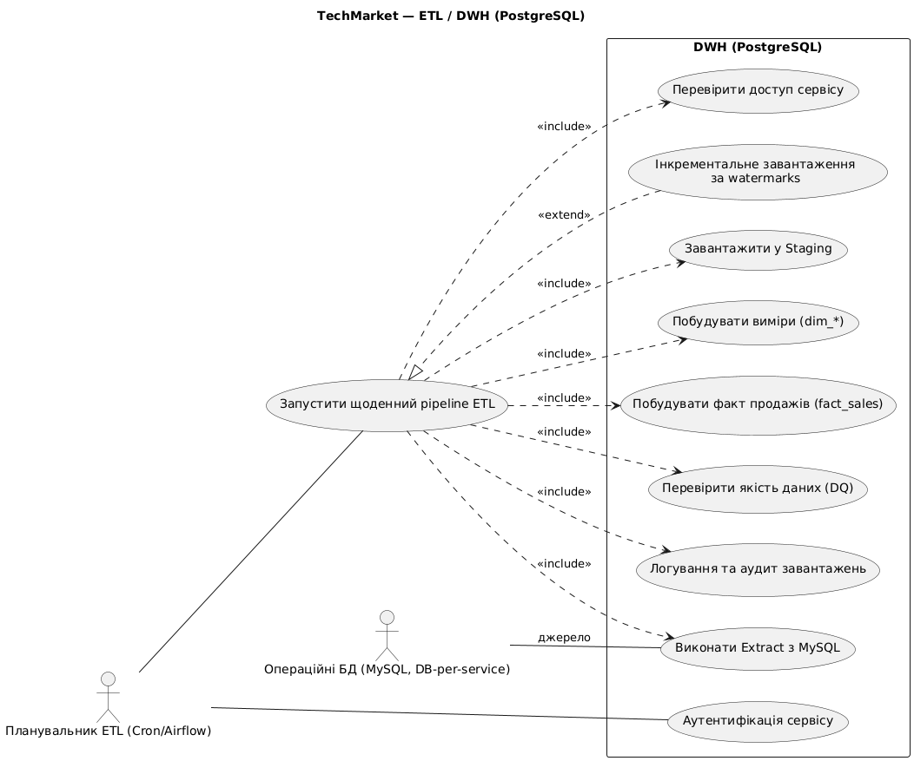
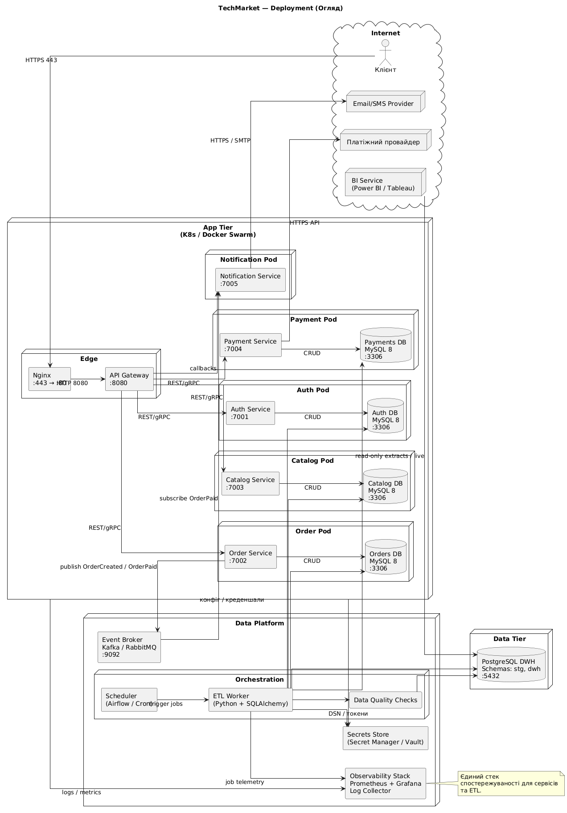
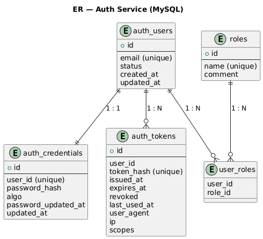
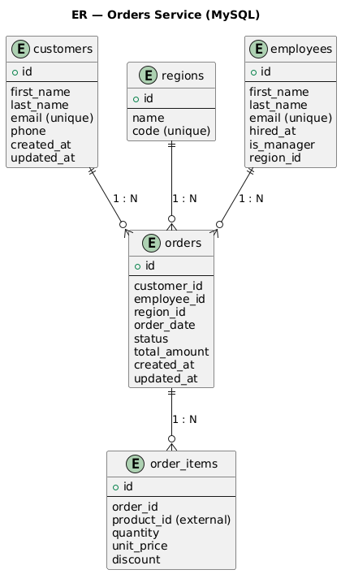

# Звіт з архітектури TechMarket

## 1. Огляд
TechMarket розгортається як платформа на базі Docker з мікросервісною архітектурою. Вхідний трафік завершується на Nginx (443) і проксуюється до API Gateway (8080). Gateway маршрутизує запити до доменних сервісів: аутентифікація (7001), замовлення (7002), каталог (7003), платежі (7004), нотифікації (7005). Операційні дані зберігаються за принципом DB‑per‑service (окрема MySQL, 3306, для кожного сервісу). Аналітичні навантаження збираються у DWH на PostgreSQL (5432). Prometheus (9090) збирає метрики, Grafana (3000) надає дашборди. Для асинхронної взаємодії використовується брокер подій Kafka/RabbitMQ (9092), централізовані логи - 9200. ETL‑процеси (7100+) запускаються планувальником (Cron/Airflow).

## 2. Діаграми та описи
Нижче наведено ключові діаграми з короткими поясненнями контексту, ролей і взаємодій.

### 2.1 Use Case - Огляд

Опис:
- Актори: Керівництво, BI Аналітик, DBA/Адміністратор, Планувальник ETL, Операційні БД (DB‑per‑service).
- Ключові кейси: проєктування схем, доступи, щоденний ETL, DQ‑перевірки, BI‑звіти, керування користувачами/ролями/доступом.
- Зв’язки: BI включає профільні KPI‑кейси, ETL включає DQ; DBA керує доступами.

### 2.2 Use Case - Операційні сервіси

Опис:
- Бізнес‑операції: реєстрація/вхід, оформлення замовлення, додавання позицій, знижки, оплата, призначення менеджера/регіону.

### 2.3 Use Case - ETL / DWH

Опис:
- Pipeline: Extract із сервісних БД -> Load у `stg` -> побудова `dim_*` -> консолідація `fact_sales` -> аудит.
- Інкременти за watermark; DQ‑перевірки; сервісна автентифікація - узагальнено.

### 2.4 Use Case - BI

Опис:
- BI‑аналітик і керівництво працюють із моделлю DWH: створення дашбордів, RLS/ролі, публікація і розсилка. 
- Tableau: Desktop — розробка/публікація, Extract/Live; Server — хостинг звітів, розклади оновлень екстрактів.

### 2.5 Sequence - Вхід користувача

Опис:
- Кроки: UI -> Gateway -> Auth Service. Пошук користувача, перевірка пароля, створення сесії/токена, збереження у Auth DB, логування, повернення токена клієнту. Обробка помилок: користувача не знайдено/пароль невірний.

### 2.6 Sequence - Оформлення замовлення

Опис:
- Кроки: UI -> Gateway -> Order Service. Валідація токена в Auth, отримання даних товарів/цін у Catalog, створення замовлення і позицій в Orders DB, ініціація платежу в Payment -> PSP, оновлення статусів, публікація події `OrderPaid` у брокер, Notification споживає подію і надсилає підтвердження клієнту.

### 2.7 Activity - BI (Динаміка продажів)

Опис:
- Авторизація та RLS у BI, вибір звіту, застосування фільтрів (регіон/категорія/дати).
- Import: оновлення кешу датасету з DWH; DirectQuery/Live: отримання агрегованих даних із DWH з урахуванням фільтрів. Рендер графіків, drill‑down/drill‑through, експорт/підписки.

### 2.8 Deployment (огляд)

Опис:
- Internet: зовнішні інтеграції (платіжний провайдер, Email/SMS, BI Service) та кінцевий користувач.
- App Tier: Nginx (443 -> 80) і API Gateway (8080) у DMZ, за ними мікросервіси (Auth 7001, Order 7002, Catalog 7003, Payment 7004, Notification 7005) у власних pod/контейнерах, кожен із приватною MySQL (3306).
- Data Platform: Scheduler/Airflow тригерять ETL, який читає MySQL (RO), вантажить у DWH, запускає DQ; Event Broker (Kafka/RabbitMQ) стоїть між Order і Notification; Observability stack (Prometheus, Grafana, лог-колектор) та Secrets Manager обслуговують сервіси.
- Data Tier: PostgreSQL DWH (5432, `stg`/`dwh`) для аналітики.
- Потоки: клієнт -> Nginx -> Gateway; Gateway маршрутизує до сервісів; Payment інтегрується з PSP; Notification надсилає Email/SMS; Order публікує події у Broker, Notification споживає; BI Service читає DWH; усі сервіси віддають метрики/логи в Observability та тягнуть секрети з Secrets Manager.

## 3. Дані та схеми
- DB‑per‑service: кожен сервіс володіє своєю схемою/БД; міжсервісні посилання - ідентифікаторами (без міжбазових FK).
- Джерела:
  - `docs/db/auth_mysql.dbml` - ідентичність і ролі
  - `docs/db/orders_mysql.dbml` - клієнти, співробітники, замовлення, позиції
  - `docs/db/catalog_mysql.dbml` - категорії, товари
  - `docs/db/payments_mysql.dbml` - платежі
- Аналітика: інкрементальний ETL до DWH (зоряна схема `fact_sales` + `dim_*`).

### 3.1 ER‑діаграми (операційні БД)

Auth Service (MySQL)

Orders Service (MySQL)

Catalog Service (MySQL)

Payment Service (MySQL)

### 3.2 ER‑діаграма (DWH)

DWH (PostgreSQL, зоряна схема — без типів даних)

## 4. Спостережуваність та експлуатація
- Prometheus (9090) збирає `/metrics` з кожного сервісу (7001–7005); Grafana (3000) візуалізує.
- Централізовані логи - 9200; брокер подій - 9092; DQ/ETL - 7100+.
- Оркестрація: Docker (можлива реалізація через docker‑compose/Swarm/Kubernetes).

## 5. Примітки щодо доступу ETL
- Прямий RO‑доступ до БД сервісів обрано для продуктивності (bulk‑читання, snapshot‑ізоляція) та повноти даних.
- Альтернативи: CDC (Debezium/binlog -> Kafka), спеціальні bulk‑API або read‑replica/data‑export шар. Можуть бути застосовані за вимогами безпеки/ізоляції.
